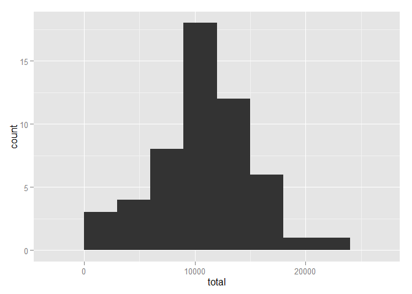
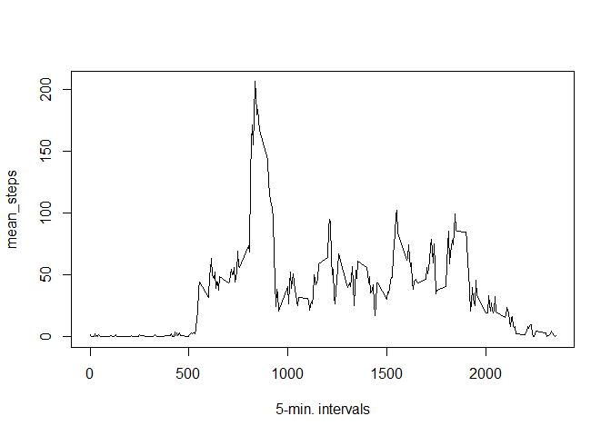
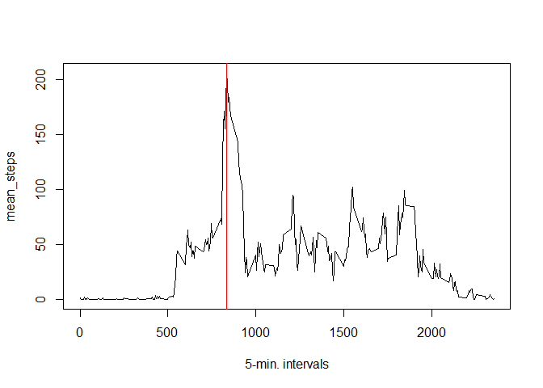
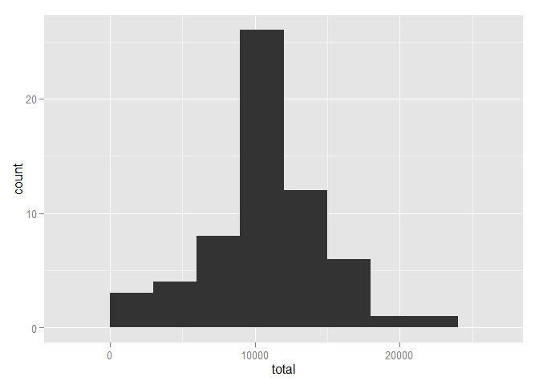
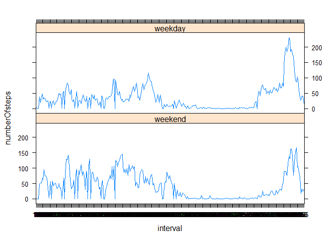

# Reproducible Research: Peer Assessment 1


## Loading and preprocessing the data

Assumed to be in "RepData_PeerAssessment1"" repository folder with zip csv.


```r
adata=read.csv(unzip("./activity.zip"),header=TRUE, sep=",")
adata$date=as.Date(adata$date, "%Y-%m-%d")
```

## What is mean total number of steps taken per day?

1. Total number of steps taken per day.


```r
library(dplyr)
```

```
## 
## Attaching package: 'dplyr'
## 
## The following objects are masked from 'package:stats':
## 
##     filter, lag
## 
## The following objects are masked from 'package:base':
## 
##     intersect, setdiff, setequal, union
```

```r
day_group<-group_by(adata, date)
step_totals<-summarize(day_group, total=sum(steps))
step_totals
```

```
## Source: local data frame [61 x 2]
## 
##          date total
## 1  2012-10-01    NA
## 2  2012-10-02   126
## 3  2012-10-03 11352
## 4  2012-10-04 12116
## 5  2012-10-05 13294
## 6  2012-10-06 15420
## 7  2012-10-07 11015
## 8  2012-10-08    NA
## 9  2012-10-09 12811
## 10 2012-10-10  9900
## ..        ...   ...
```

2. Histogram of total number of steps taken per day.


```r
library(ggplot2)
ggplot(step_totals, aes(x=total)) + geom_histogram(binwidth = 3000)
```

 

3. Calulate the mean and median of total number of steps taken per day.


```r
mean_totalsteps<-mean(step_totals$total,na.rm=TRUE)
mean_totalsteps
```

```
## [1] 10766.19
```

```r
median_totalsteps<-median(step_totals$total,na.rm=TRUE)
median_totalsteps
```

```
## [1] 10765
```

## What is the average daily activity pattern?

1. Time series plot of the 5-minute interval (x-axis) and the average (mean) number of steps taken, averaged across all days (y-axis).


```r
mean_steps<-tapply(adata$steps, adata$interval, mean, na.rm = TRUE)
plot(rownames(mean_steps), mean_steps, type="l", xlab="5-min. intervals")
```

 

2. Which 5-minute interval, contains the maximum number of steps?

Answer: interval 835

```r
max_steps<-names(which(mean_steps==max(mean_steps)))
plot(rownames(mean_steps), mean_steps, type="l", xlab="5-min. intervals")
abline(v=as.numeric(max_steps<-names(which(mean_steps==max(mean_steps)))), col="red")
```

 

```r
max_steps
```

```
## [1] "835"
```

## Imputing missing values

1. Total number of missing values in dataset.

Answer: 2304 missing values

```r
rows_na<-sum(is.na(adata$steps))
rows_na
```

```
## [1] 2304
```

2. Devise strategy for filling in all of the missing values in the dataset with mean/median for that day or that interval.

NOTE: My strategy is to reuse the "mean_steps" list. First match NA rows in a copied dataset "new data" to  the "mean_steps" list using "is.na" on the "steps" column. Then use use the corresponding interval values "as.character" to select the correct mean value from the list that will be imputed into the new dataset.

3. Create new dataset equal to original but with the missing data filled in.


```r
newdata<-adata
newdata$steps[is.na(newdata$steps)]<-mean_steps[as.character(newdata$interval)]       
```

```
## Warning in newdata$steps[is.na(newdata$steps)] <-
## mean_steps[as.character(newdata$interval)]: number of items to replace is
## not a multiple of replacement length
```

4. Histogram of the new dataset for total number of steps taken per day.


```r
new_day_group<-group_by(newdata, date)
new_step_totals<-summarize(new_day_group, total=sum(steps))
new_step_totals
```

```
## Source: local data frame [61 x 2]
## 
##          date    total
## 1  2012-10-01 10766.19
## 2  2012-10-02   126.00
## 3  2012-10-03 11352.00
## 4  2012-10-04 12116.00
## 5  2012-10-05 13294.00
## 6  2012-10-06 15420.00
## 7  2012-10-07 11015.00
## 8  2012-10-08 10766.19
## 9  2012-10-09 12811.00
## 10 2012-10-10  9900.00
## ..        ...      ...
```

```r
ggplot(new_step_totals, aes(x=total)) + geom_histogram(binwidth = 3000)
```

 

Calculate the new mean and median of total number of steps taken per day.

```r
new_mean_totalsteps<-mean(new_step_totals$total,na.rm=TRUE)
new_mean_totalsteps
```

```
## [1] 10766.19
```

```r
new_median_totalsteps<-median(new_step_totals$total,na.rm=TRUE)
new_median_totalsteps
```

```
## [1] 10766.19
```
The impact of imputing missing data with the mean values on the estimates of the total daily number of steps caused the median to shift up in value and match the mean. The imputing with additional values caused the frequency count of total daily number of steps to shift up across all the totals, making the median match the mean.

```r
summary(median_totalsteps)
```

```
##    Min. 1st Qu.  Median    Mean 3rd Qu.    Max. 
##   10760   10760   10760   10760   10760   10760
```

```r
summary(new_median_totalsteps)
```

```
##    Min. 1st Qu.  Median    Mean 3rd Qu.    Max. 
##   10770   10770   10770   10770   10770   10770
```

No changes for the mean.

```r
summary(mean_totalsteps)
```

```
##    Min. 1st Qu.  Median    Mean 3rd Qu.    Max. 
##   10770   10770   10770   10770   10770   10770
```

```r
summary(new_mean_totalsteps)
```

```
##    Min. 1st Qu.  Median    Mean 3rd Qu.    Max. 
##   10770   10770   10770   10770   10770   10770
```

## Are there differences in activity patterns between weekdays and weekends?

1. Add a new factor variable in the new dataset with two levels of "weekday" and "weekend."


```r
library(lubridate)
newdata$day<-as.factor(ifelse(match(wday(newdata$date),c(1,7), nomatch=0), "weekend", "weekday"))
```

2. Make a two panel plot with a time series plot (type="l") of 5-min. interval (x-axis) and the average (mean) number of steps taken. One panel for averages across weekdays and the other for averages across the weekend (y-axis).


```r
library(lattice)
ndata.weekday<-subset(newdata, day=="weekday")
ndata.weekend<-subset(newdata, day=="weekend")
wkday_mean_steps<-tapply(ndata.weekday$steps, ndata.weekday$interval, mean, na.rm = TRUE)
wkend_mean_steps<-tapply(ndata.weekend$steps, ndata.weekend$interval, mean, na.rm = TRUE)
df1 <- data.frame(matrix(unlist(wkend_mean_steps)),interval=names(wkend_mean_steps),day="weekend")
names(df1)[1]<-"numberOfsteps"
df2 <- data.frame(matrix(unlist(wkday_mean_steps)),interval=names(wkday_mean_steps),day="weekday")
names(df2)[1]<-"numberOfsteps"
df <- rbind(df1,df2) #combine new data frames
df <- df[with(df, order(interval)), ] #order data frames
rownames(df) <- NULL #reindex data frames
xyplot(numberOfsteps ~ interval | day, data=df, type="l", layout= c(1,2))
```

 

